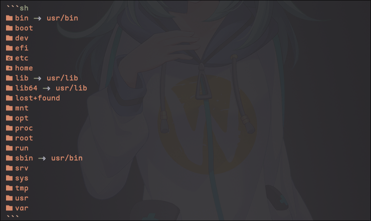
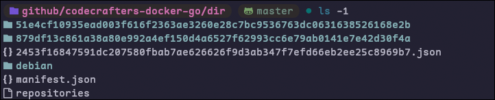

## Containers for dummies

_Disclaimer_
I am a dummy myself, this is how someone like myself understands
a concept that seems a lot more complex than it really is. Containers are awesome
but the current ecosystem around them is NOT simple whatsoever, and finding answers
in plain English is next to impossible.

So, with my limited understanding, in programming and in containers...
I will try my best to make a simple explanation so that anyone can get the
basic idea (including myself) I have less than a year of experience with Linux, programming
and containers.

---

## **Containers**

## Why a container?

The Magic Box: Think of a Linux container as a special box that you can put your toys (or programs) in. This box is like a mini-computer inside your computer.

Isolation: Each box (container) is like its own little world. Inside, you can have one program, like a game, and it won't know or bother the other programs in their own boxes. It's like having separate rooms for your toys.

Sharing: Even though they're in separate boxes, containers can still talk to the outside world when they need to. They can share some things, like the internet or files, but only if you let them.

Easy to Move: Containers are like toy boxes that you can easily pick up and move to different places, like to your friend's house or even to a big playground (which is a real computer server). This makes it easy to run the same program on different computers without any problems.

Consistency: When you put the same toy in different containers, it's always the same toy. Similarly, when you put the same program in different containers, it behaves the same way, which helps keep things predictable and reliable.

Resource Control: You can also decide how much space, memory, and CPU power each container gets. It's like saying, "This container can have a big play area, but that one only gets a small space."

So, Linux containers are like magical boxes that let you keep your programs separate, but still, let them play nicely together when you want. They make it easy to move your programs around and control how much of your computer's resources they use. It's like having a neat and organized way to play with all your favorite toys!

---

## What make's up a container?

The Root File System: Think of the root file system as a magic sandbox. It's like a small world where your toy programs will live. You start by making a special folder (sandbox) on your computer and put everything your toy program needs inside it. This includes all the toy parts and instructions (files and programs) that your toy needs to work.

chroot Command: Now, you use a special command called chroot. It's like a magic spell that says, "Hey, toy program, you can only see and play with the stuff inside this sandbox!" You run this command to enter the sandbox, and now your toy program thinks it's in its own little world.

Process Isolation: Once inside the sandbox, your toy program can't see or touch anything outside of it. It's like putting a bubble around it so it doesn't mess up your room (your main computer). It can only play with the toys (files and programs) you put inside the sandbox.

So, you've created a container by making a special sandbox (root file system), using the chroot command to enter it, and then isolating your toy program so it can't affect anything outside the sandbox. This way, you can run different programs in their own sandboxes without them causing chaos in your room (computer).

---

Containers are deceptively simple things.
Go ahead and run:

```sh
  ls /
```

we should see something like this:



```sh
bin -> usr/bin
boot
dev
efi
etc
home
lib -> usr/lib
lib64 -> usr/lib
lost+found
mnt
opt
proc
root
run
sbin -> usr/bin
srv
sys
tmp
usr
var
```

It's essentially the common Linux filesystem. Most root directories are structured in a fairly similar way.
We can see some directories and a few symlinks to other directories for compatibility reasons.

---

in `/usr/bin` we see binaries that are often found on most Linux distributions. Like
the core utilities for example (ls, cat, less, head, sed, chroot, sudo) etc...

Poking around in there and we see a lot of interesting things and locations where
files are kept. Including libs in `/usr/lib` and boot files in `/boot` as well as some
symlinks to other directories for compatiblity and legacy reasons.

For the most part, this is what makes up the core of a Linux system (besides the Kernel)

---

## Creating our own Container.

The goal is replicating the root folder of a linux system, and isolating the filesystem and the
namespace that programs run in.

First:

- Pull an image from Docker hub (or a similar registry)
  run the included image pull script that I got from github.com/moby/moby

```sh
  # ./download-frozen-image.sh <output-dir> <image>
  ./download-frozen-image.sh arch-dir archlinux:latest
```

This will downlaod the latest arch linux image from Docker hub.
Docker hub has a lot of images that you can pull from and a lot of different
release tags from the creators of the image. Like `archlinux:base-devel` or
`debain:latest` etc...

Lets run `ls arch-dir` to see the contents of the directory that holds the information
about the image we just downloaded...



```
51e4cf10935ead003f616f2363ae3260e28c7bc9536763dc0631638526168e2b
879df13c861a38a80e992a4ef150d4a6527f62993cc6e79ab0141e7e42d30f4a
2453f16847591dc207580fbab7ae626626f9d3ab347f7efd66eb2ee25c8969b7.json
manifest.json
repositories
```

oof, that looks like shit. Whats with this gibberish?
lets pick it apart one by one...

lets look in the `manifest.json`

```json
[
  {
    "Config": "2453f16847591dc207580fbab7ae626626f9d3ab347f7efd66eb2ee25c8969b7.json",
    "RepoTags": ["archlinux:latest"],
    "Layers": [
      "879df13c861a38a80e992a4ef150d4a6527f62993cc6e79ab0141e7e42d30f4a/layer.tar",
      "51e4cf10935ead003f616f2363ae3260e28c7bc9536763dc0631638526168e2b/layer.tar"
    ]
  }
]
```

Opening the `Config` field json we can see some basic information about the image...
The output is long but I will summarize it.

- It contains an entry point command `/usr/bin/bash`
- the $PATH variable, LC_ALL=C and other arch linux default environment variables.
- Alongside some info about the maintainers, License, and things like that. As well as some history on the container.

Hey! We recognize those `RepoTags` thats what we used to pull this image.
whats really important to start things off is the Layers.

---

## **Layers**

Lets list the contents of the first layer.

```sh
  tar --list --file "879df13c861a38a80e992a4ef150d4a6527f62993cc6e79ab0141e7e42d30f4a/layer.tar
```

If we only look at the files at the top level we get:


Wow! It looks exactly like when we ran `ls /` earlier! That's because it is. (for the most part)
this is our base system layer! It contains all of the same system files that would be found on
any normal Linux system after a fresh install.

The first layer is our base system layer.

---

Lets look at the next layer

```sh
  tar --list --file 51e4cf10935ead003f616f2363ae3260e28c7bc9536763dc0631638526168e2b/layer.tar
```

Hmm, its similar but only has a few files instead of the 100's of files that the base layer had.

```
etc/
etc/ld.so.cache
etc/os-release
var/
var/cache/
var/cache/ldconfig/
var/cache/ldconfig/.wh..wh..opq
var/cache/ldconfig/aux-cache
```

thats because this is the next "Layer" that needs to be overlayed on to the base layer.
This layer is sort of like a "diff", meaning that instead of distributing the full system
image _plus_ these small changes to certain files, we just put the difference between
the layers into a new layer and distribute the changed files.

---

- example:
  if I wanted to add a `/nix` folder in the root directory and distribute that as an image,
  would I rather create a whole new tar archive that contains all of the base system files
  with my changes included...

- or would I just keep the base image as its own layer and create
  a new layer that contains the `/nix` directory?

Obviously its the latter. It would be very
ineffecient space-wise to distribute every change as a full image file. So instead we `layer` all
changes. This provides a lot of layers of convenience. We can easily revert changes by removing a
layer, or make new changes by adding a new layer.

To finish the example, we could create a `layer.tar` that contains our `/nix` folder
(You don't need to do this part, this is to better understand why layers are used)

```
  mkdir -p our_layer/nix
  tar -cf our_layer/layer.tar our_layer/nix
```

and add our layer to the Json

```json
[
  {
    "Config": "2453f16847591dc207580fbab7ae626626f9d3ab347f7efd66eb2ee25c8969b7.json",
    "RepoTags": ["archlinux:latest"],
    "Layers": [
      "879df13c861a38a80e992a4ef150d4a6527f62993cc6e79ab0141e7e42d30f4a/layer.tar",
      "51e4cf10935ead003f616f2363ae3260e28c7bc9536763dc0631638526168e2b/layer.tar",
      "our_nix_folder_layer_would_go_here/layer.tar"
    ]
  }
]
```

Now we can easily use any combination of these layers as we need to. We can also easily add
new layers or revert back to the base layer if you want to undo changes. In its simplest form
it is a form of `version control` with the idea of distributing the most minimal amount of data.

Don't worry if this is a little dense, it'll make more sense once you see it happen... So lets do it.

---

## Creating a Container using Docker hub image metadata manually

Its hard af to get a straight answer on creating a docker image manually, WITHOUT using Docker/Podman directly.
It's useless. We want to understand wtf is happening, and not rely on every little abstraction
to carry us.

- So here's how:

(Please note that you can do this manually, or programatically - like pulling this info
directly from Docker and parsing the layers and doing the following instructions)

Alright lets freaking go already:

- Create a temp directory

```sh
  mkdir my_pod
```

- Extract the base layer

```sh
  tar --extract --file 879df13c861a38a80e992a4ef150d4a6527f62993cc6e79ab0141e7e42d30f4a/layer.tar --directory=my_pod/
```

Now our "base image" is in our temp directory

- Extract the other layers
  the layers are in descending order, meaning we go through the `layers` field of our `manifest.json`
  one at a time and extract each one into the `my_pod` temp directory that will serve as our new root
  folder for our image

this tar command extracts `X` file into the specified `directory`

```sh
  tar --extract --file 51e4cf10935ead003f616f2363ae3260e28c7bc9536763dc0631638526168e2b/layer.tar --directory=my_pod/
  # if we want to put our own layer on top of that we could do so with our own layer
  tar --extract --file our_nix_folder_layer_would_go_here/layer.tar --directory=my_pod/
```

tar in this case is overwriting the files in the base image layer with the files in our newer layers.
this is so that we can apply our changes and revisions as described earlier.

At this point we essentially have 90% of a container.
The next to critical steps left are:

- `Chroot`
- and `Process isolation`

for now lets just worry about chroot. Lets just use the Unix coreutil util `chroot`

---

- Run:

```sh
  sudo chroot my_pod
```

and BOOM babyyy! you should see:

```sh
[root@sweetd /]#
```

---

the same thing in Go-lang would look like:

```go
  // .. ^ more stuff up here
	// now we chroot into the temporary directory
	err = syscall.Chroot(tempDir)
	if err != nil {
		fmt.Printf("Error chrooting: %v\n", err)
		return err
	}

// This function isolates the process by creating new namespaces
func isolateProcess() error {
	// adding addtional namespace i.e., pid namespace, UTS namespace, mount namespace for more isolation
	if syscall.Unshare(syscall.CLONE_NEWUTS|syscall.CLONE_NEWPID|syscall.CLONE_NEWNS) != nil {
		return fmt.Errorf("Error unsharing")
	}
	return nil
}
```

In this case we also create a new Namespace for the container so that the processes are isolated
as well.

---

## Wrapping up

In the most simplest terms a `Container` is a directory that pretends to be a linux `/` root folder...

Then, we ask the Linux Kernel:
"Hey, bro can you treat this folder as a `root` directory and give that baby a
shiny new namespace/pid namespace/mount namespace to frolick and play in?"

and Linus Torvalds is personally like,
"Yea, dude. I got you fam. You are now chilling in a new root."

We have "Changed root's" so to speak... wait a minute Ch..ange root? Ch-root? CHROOT! CHROOT! CHROOT!

---

This has been a lesson on containers from a complete noob dumbass. Thanks for coming to my Ted Talk.
